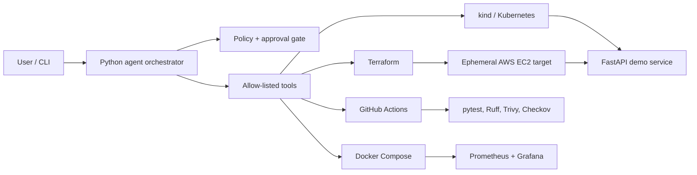

# OpsPilot — Cost-Guarded AWS DevOps Agent

OpsPilot is a portfolio-grade Python DevOps agent that plans and executes allow-listed deployment operations with approval gates. It demonstrates Docker, Kubernetes, Terraform, GitHub Actions, security scanning, monitoring, deployment verification, rollback, and AWS cost controls without requiring an always-on paid Kubernetes control plane.

> **Safety default:** every infrastructure or deployment action is a dry run unless `--execute` is supplied. Destructive actions still require interactive approval unless CI explicitly sets `OPSPILOT_APPROVED=true`.

## Architecture



The default showcase path is local-first: Docker Compose for the application and observability, plus `kind` for Kubernetes validation. AWS is an optional, time-boxed deployment target. EKS is intentionally not the default: its standard control plane is charged per cluster-hour before worker nodes.

## Quick start

Requirements: Python 3.12+, Docker, and optionally Terraform, kubectl, and kind.

```bash
python -m venv .venv
# PowerShell: .venv\Scripts\Activate.ps1
pip install -e ".[dev]"
pytest
docker compose up --build
```

Open `http://localhost:8000/health`, Prometheus at `http://localhost:9090`, and the provisioned OpsPilot Grafana dashboard at `http://localhost:3000/d/opspilot-overview/opspilot-overview` (`admin` / `admin`, local demo only).

Use the agent:

```bash
opspilot status
opspilot plan
opspilot deploy-local
opspilot deploy-k8s
opspilot aws-plan
opspilot aws-apply --execute
opspilot rollback --execute
opspilot aws-destroy --execute
```

An optional natural-language interface uses the OpenAI Responses API and function tools. Set `OPENAI_API_KEY`, install the `agent` extra, and run `opspilot ask "check the project status"`. The deterministic CLI remains fully usable without an API key.

## Published image and supply-chain evidence

After CI succeeds for a push to `main`, GitHub Actions publishes the application as
`ghcr.io/rahulmt007/opspilot:<full-git-sha>`. The workflow records the registry digest,
generates an SPDX JSON SBOM, attaches it as a keyless-signed Cosign attestation, and signs
the image digest with GitHub OIDC. A separate job verifies that the immutable SHA tag
resolves to the expected digest and validates both the signature and SBOM attestation.

All third-party GitHub Actions are pinned to full commit SHAs. Human-readable version
comments beside each pin make controlled upgrades reviewable.

## Repository map

- `src/devops_agent/`: FastAPI demo app, guarded command runner, CLI, optional LLM router
- `infra/terraform/`: minimal AWS network, security group, EC2 host, budget, TTL tagging
- `deploy/k8s/`: local `kind` manifests with probes, resources, and rolling updates
- `compose.yaml`: local application, Prometheus, and Grafana stack
- `monitoring/`: Prometheus configuration and provisioned Grafana datasource/dashboard
- `.github/workflows/`: CI and manual, OIDC-authenticated AWS planning
- `docs/ARCHITECTURE.md`: decisions, threat model, and cost envelope
- `docs/ROADMAP.md`: phased implementation and LinkedIn demo script
- `docs/PHASE0_AWS_SAFETY.md`: AWS account safety and GitHub OIDC bootstrap

## Cost guardrails

- No NAT Gateway, ALB, RDS, EKS, Route 53 zone, or always-on Jenkins controller.
- GitHub Actions replaces Jenkins by default; `Jenkinsfile` is included as a portable pipeline demonstration.
- AWS resources are optional, tagged with `Project`, `Environment`, `Owner`, and `ExpiresAt`.
- Terraform requires an explicit monthly budget amount and installs budget notifications when an email is supplied.
- EC2 defaults to one small instance and one small encrypted root volume; SSH ingress defaults to no addresses.
- AWS planning uses a protected GitHub Environment and OIDC rather than long-lived AWS keys.
- Apply and destroy stay disabled until durable remote Terraform state is configured.
- `scripts/find-expired-resources.sh` identifies expired project resources; `terraform destroy` remains the cleanup authority.

Read [the architecture](docs/ARCHITECTURE.md) before creating AWS resources. AWS eligibility and pricing depend on account creation date, region, and current offers; treat credits as a cap, not a design target.

## License

MIT
