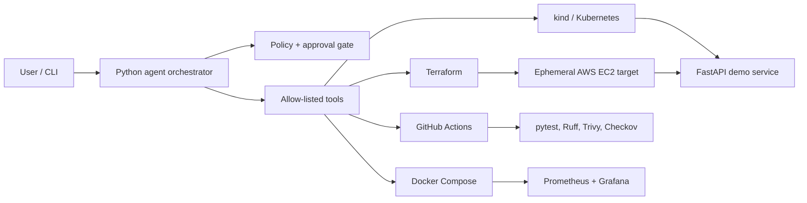

# OpsPilot — Cost-Guarded AWS DevOps Agent

OpsPilot is a portfolio-grade Python DevOps agent that plans and executes allow-listed deployment operations with approval gates. It demonstrates Docker, Kubernetes, Terraform, GitHub Actions, security scanning, monitoring, deployment verification, rollback, and AWS cost controls without requiring an always-on paid Kubernetes control plane.

> **Safety default:** every infrastructure or deployment action is a dry run unless `--execute` is supplied. Destructive actions still require interactive approval unless CI explicitly sets `OPSPILOT_APPROVED=true`.

## Architecture



The default showcase path is local-first: Docker Compose for the application and observability, plus `kind` for Kubernetes validation. AWS is an optional, time-boxed deployment target. EKS is intentionally not the default: its standard control plane is charged per cluster-hour before worker nodes.

## Quick start

Requirements: Python 3.12+, Docker, and optionally Terraform, kubectl, and kind.

```bash
python -m venv .venv
# PowerShell: .venv\Scripts\Activate.ps1
pip install -e ".[dev]"
pytest
docker compose up --build
```

Open `http://localhost:8000/health`, Prometheus at `http://localhost:9090`, and Grafana at `http://localhost:3000` (`admin` / `admin`, local demo only).

Use the agent:

```bash
opspilot status
opspilot plan
opspilot deploy-local
opspilot deploy-k8s
opspilot aws-plan
opspilot aws-apply --execute
opspilot rollback --execute
opspilot aws-destroy --execute
```

An optional natural-language interface uses the OpenAI Responses API and function tools. Set `OPENAI_API_KEY`, install the `agent` extra, and run `opspilot ask "check the project status"`. The deterministic CLI remains fully usable without an API key.

## Repository map

- `src/devops_agent/`: FastAPI demo app, guarded command runner, CLI, optional LLM router
- `infra/terraform/`: minimal AWS network, security group, EC2 host, budget, TTL tagging
- `deploy/k8s/`: local `kind` manifests with probes, resources, and rolling updates
- `deploy/docker/`: production-like Compose overlay
- `monitoring/`: Prometheus and Grafana provisioning
- `.github/workflows/`: CI, manual AWS deploy, rollback, and destroy workflows
- `docs/ARCHITECTURE.md`: decisions, threat model, and cost envelope
- `docs/ROADMAP.md`: phased implementation and LinkedIn demo script

## Cost guardrails

- No NAT Gateway, ALB, RDS, EKS, Route 53 zone, or always-on Jenkins controller.
- GitHub Actions replaces Jenkins by default; `Jenkinsfile` is included as a portable pipeline demonstration.
- AWS resources are optional, tagged with `Project`, `Environment`, `Owner`, and `ExpiresAt`.
- Terraform requires an explicit monthly budget amount and installs budget notifications when an email is supplied.
- EC2 defaults to one small instance and one small encrypted root volume; SSH ingress defaults to no addresses.
- Apply/deploy/destroy workflows use GitHub Environments for approval and OIDC rather than long-lived AWS keys.
- `scripts/find-expired-resources.sh` identifies expired project resources; `terraform destroy` remains the cleanup authority.

Read [the architecture](docs/ARCHITECTURE.md) before creating AWS resources. AWS eligibility and pricing depend on account creation date, region, and current offers; treat credits as a cap, not a design target.

## License

MIT
